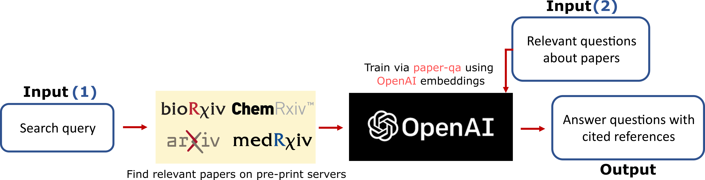

# Decode-ELM
Decoding cited knowledge from scientific preprint servers. This tool will allow you to ask questions and get answers based on scientific papers. It uses OpenAI's GPT models, and you must have your own API key. Each query is about 10k tokens, which costs about only $0.20 on your own API key, charged by OpenAI. Current version searches on different pre-print servers including [arXiv](https://arxiv.org), [chemRxiv](https://chemrxiv.org/engage/chemrxiv/public-dashboard), [bioRxiv](https://www.biorxiv.org/) and [medRxiv](https://www.medrxiv.org/). Used libraries: [PaperQA](https://github.com/whitead/paper-qa) and  [langchain](https://github.com/hwchase17/langchain).

🚧Under development🚧

This app is hosted on HuggingFace:

https://huggingface.co/spaces/mehradans92/decode-elm

See this [tweet](https://twitter.com/MehradAnsari/status/1627649959204888576) for a demo.
